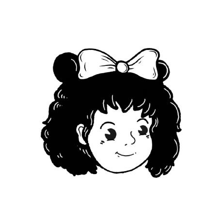

<body>
  

    
    <h2 style='margin: 0;'>mabuhay, ako si yumi.</h2>
    <h3> <a class="webLink" style='font-size: 24px; font-weight: bold;' href="https://bento.me/yumiclmpn" target="_blank">my bento.</a> </h3>
    <h2>languages i'm currently learning.</h2>
  

   
    
  

    
  

    
   

  

    <h2>my github status.</h2>
    

      
      
    

  

   

  

    <h2>my other status.</h2>
    

      
      
    

  

