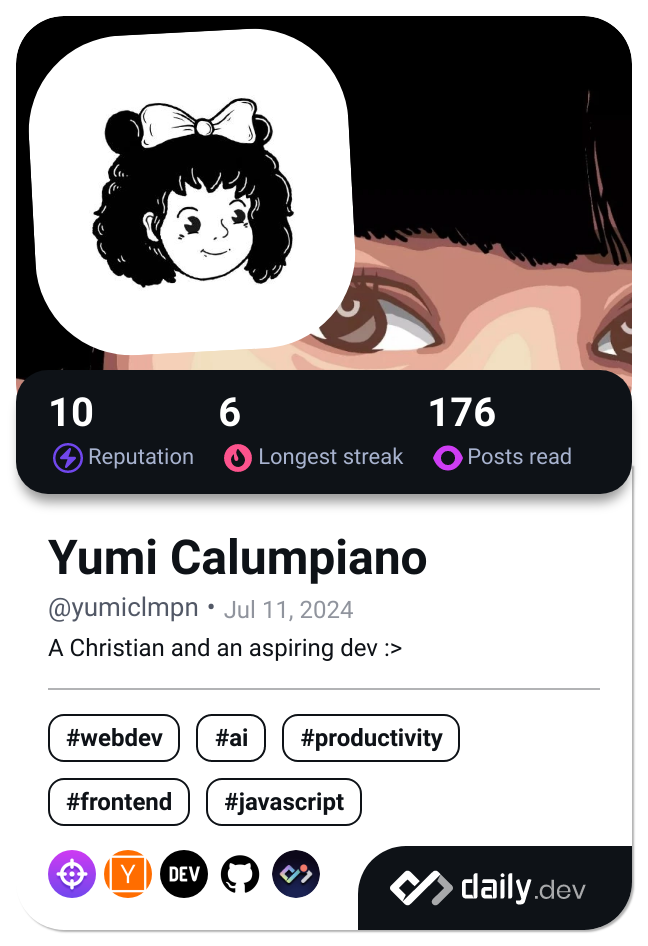

<a class="libutton" style="display: flex; flex-direction: column; justify-content: center; padding: 7px; text-align: center; outline: none; text-decoration: none !important; color: #ffffff !important; width: 200px; height: 32px; border-radius: 16px; background-color: #0A66C2; font-family: "SF Pro Text", Helvetica, sans-serif;" href="https://www.linkedin.com/comm/mynetwork/discovery-see-all?usecase=PEOPLE_FOLLOWS&followMember=yumiclmpn" target="_blank">Follow on LinkedIn</a>

